# 定例会資料（PowerPoint）の作り方マニュアル

受注センターの「○月度 定例会資料」を、毎月のExcel・Outlookのデータから作成する手順書です。
**初めて担当する人でも、上から順に読めば1部作り切れる**ことを目標にまとめています。

> このマニュアルは、もともとスクリーンショットだけだったものを、手順の文章を補って整理したものです。
> 各ステップの画像は `img/` フォルダに入っています。

---

## 0. 全体像（まず流れをつかむ）

定例会資料は「前月版のPowerPointをコピーして、グラフ・表・見出しを当月のデータに差し替える」作り方をします。
ゼロから作るのではなく、**毎月“中身だけ”を入れ替える**のがポイントです。

大まかな流れは次の8ステップです。

| 手順 | やること | 主に使うデータ |
|---|---|---|
| 1 | 前月版pptxをコピーして当月版を作る | ネットワークの `16_定例会` フォルダ |
| 2 | アジェンダ・タイトルの「○月度」を当月に直す | PowerPoint |
| 3 | スライド3：月別1日平均処理件数 を更新 | メインExcel `1日平均` |
| 4 | スライド4：日別処理件数 を更新 | メインExcel `新）日別処理` |
| 5 | スライド5：八神セルアウト を更新 | `★八神sellout集計` ＋ Outlook |
| 6 | スライド6：サポート業務 を更新 | `2026年度サポートグラフ` ＋ Outlook |
| 7 | スライド7：メール依頼 を更新 | `2026年度メール依頼` ＋ Outlook |
| 8 | スライド8：電話応対 を更新（グラフ＋集計表） | `202605受発信` → メインExcel `電話` |

各スライドは「**Excelでグラフを当月データにする → そのグラフをPowerPointへコピー → 分析コメントを書く**」の繰り返しです。
最後に、完成したファイルをネットワークフォルダにpptxとPDFで保存します。

> 【ポイント】**自動化ツールについて**
> 手順3〜8のグラフ・表・見出しの差し替えは、Pythonツール `make_teirei.py` でまとめて自動化できます。
> 仕組みやコマンドは末尾の「付録：自動化ツール」を参照してください。コメント記入と最終保存は引き続き手作業です。

---

## 1. 前月版をコピーして当月版を作る

ネットワークの保存先フォルダを開きます。

```
ネットワーク > 10.220.46.32 > fscwork > Tokyo > 16_定例会 > 2026
```

ここには各月の「コーディスジャパン定例会資料_2026年○月度」がpptxとPDFで入っています。
**作りたい月の前月版**（例：5月度を作るなら `2026年4月度` のpptx）をコピーして、当月版の元にします。

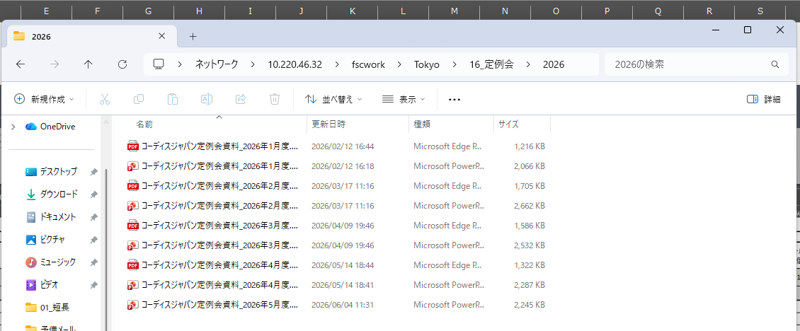

---

## 2. 月度の見出しを当月に直す

コピーしたpptxを開き、**アジェンダのスライドとタイトルの「○月度」**を当月（例：5月度）に書き換えます。

> 【注意】ここを先に直しておくのは、後で表示やコメントを書くときに月がずれないようにするためです。

### 完成イメージ（スライド3の例）

最終的に各スライドは下のような見た目になります。差し替え作業のゴールとして、先に完成形を見ておくと分かりやすいです。

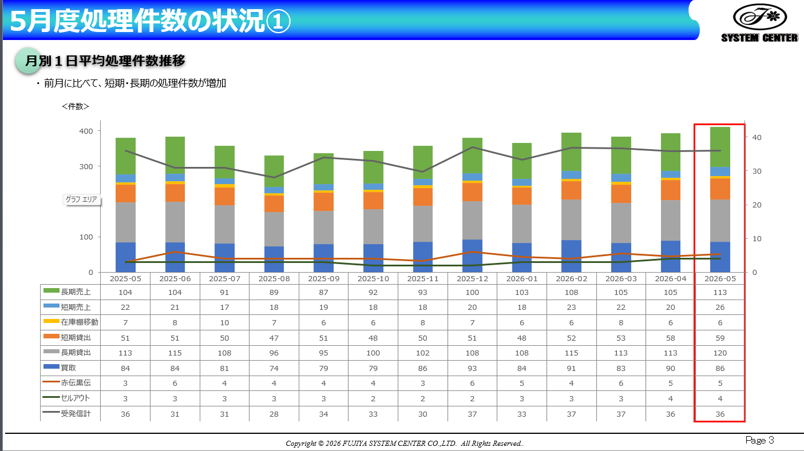

---

## 3. スライド3：月別1日平均処理件数

棒グラフ＋折れ線の複合グラフで、**直近13ヶ月の1日平均処理件数**を表示します。

### 3-1. 元データを取り込む

大元の日報データは SharePoint の **「2024定例会資料クラブ枠」** にあります。
リンク先を開き、**当月分のデータをコピー**します。

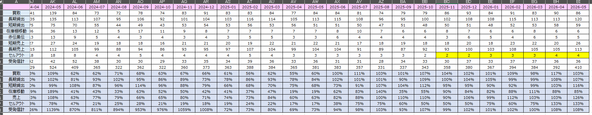

### 3-2. 「日報（件数）貼り付け用」に貼り付けて当月分を作る

`1日平均` シートは、別タブの **「日報（件数）貼り付け用」と連携（数式参照）** しています。
横にある **「日報（件数）貼り付け用」タブ**をクリックし、コピーした当月分を**すべてコピー＆ペースト**で貼り付けます。これが大元のデータになります。


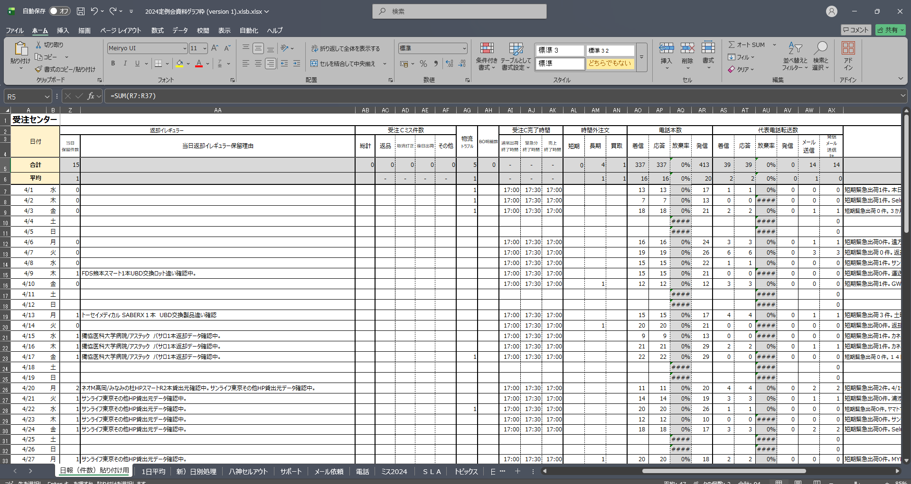

貼り付けると、`1日平均` シートの当月列にデータが流れ込み、**当月分が出来上がります**。
当月の行（処理件数）が正しく入っているかを確認します。

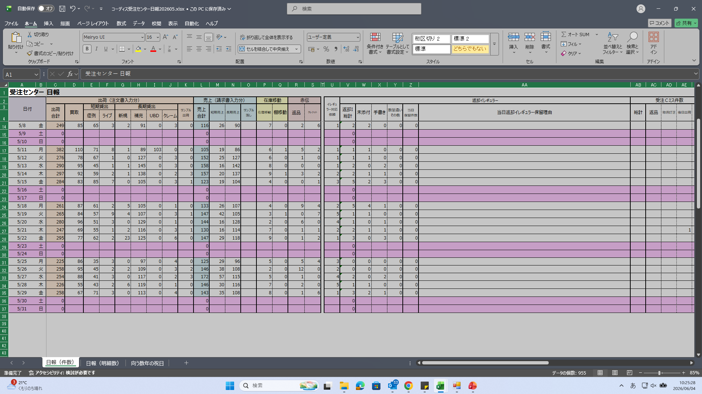

### 3-3. 前月分を「値」に置き換える（数値を固定する）

**当月分が出来たのを確認してから**、`1日平均` シートの**前月列（例：5月度を作るなら 2026-04）**を選択し、**数式を「値」に置き換え**ます。
これで前月の数値が、以降の更新で変わらないように固定されます。

**数式 ▶ 値 の変換手順**

1. 前月列を選択して**コピー**（`Ctrl + C`）
2. 選択したまま、同じ列の上で**右クリック**し、「貼り付けのオプション」から **「値」**（クリップボードに `123` が付いたアイコン）を選ぶ
   - または、右クリック →「**形式を選択して貼り付け**」→「**値**」を選んで **OK**
3. セルの中身が数式（`=…`）ではなく**数値そのもの**になっていれば完了

> 【注意】**なぜ前月分を値にするの？**
> `1日平均` は「日報（件数）貼り付け用」と連携しているため、前月分を値で固定しておかないと、
> 次回以降データを更新したときに**前月の数値まで一緒に変わってしまう**ためです。

### 3-4. グラフをPowerPointへ

`1日平均` シートのグラフが当月データで自動更新されるので、内容を確認します。

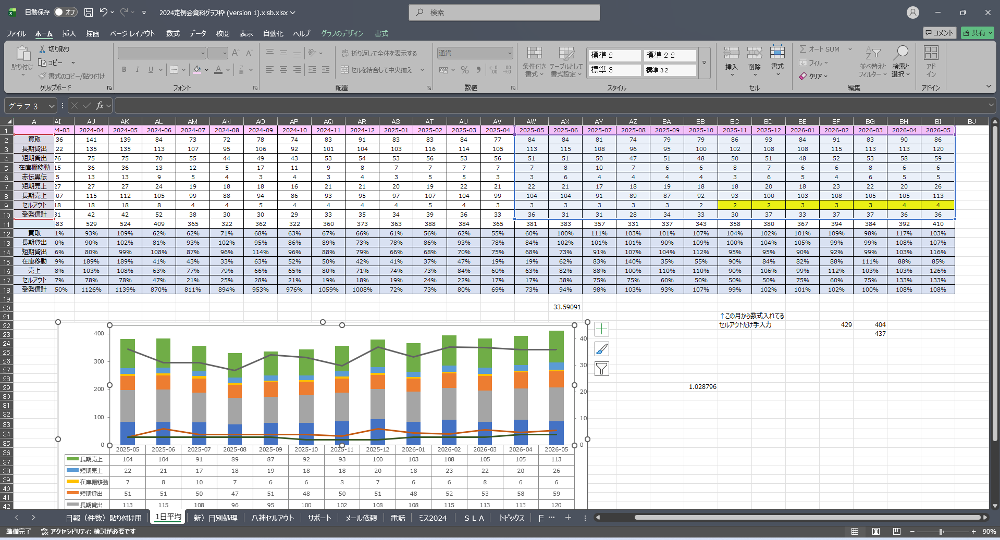

更新されたグラフを **スライド3にコピー**して貼り付けます。

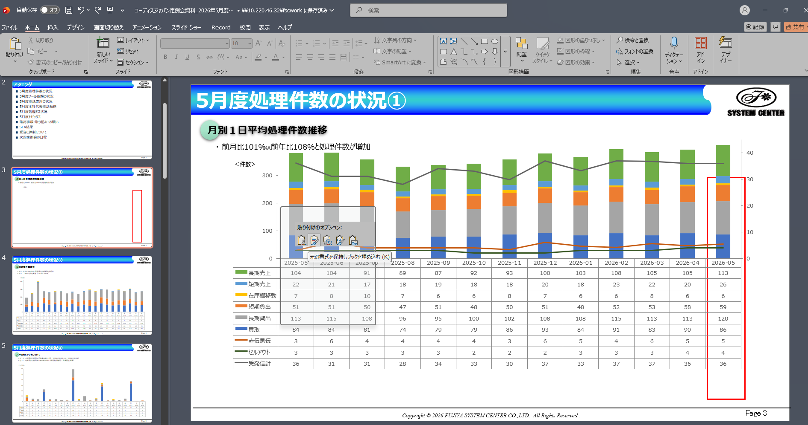

### 3-5. コメントを書く

「・前月に比べて、短期・長期の処理件数が増加」のように、**前月比の気づき**を1〜2行で記入します。

---

## 4. スライド4：日別処理件数

当月の**稼働日ごと**の処理件数を、積み上げ棒グラフで表示します。

### 4-1. 稼働日だけにする（土日祝の0列を非表示にする）

`新）日別処理` のグラフは、初期状態では土日も含めて全日付が入っています（土日は0件）。

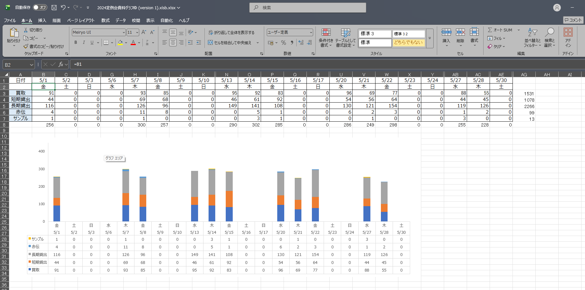

**土日祝（0件）の列を非表示**にして、平日（稼働日）だけのグラフにします。
※ 列は**削除せず非表示**にします（元データは残したまま、グラフの見た目だけ整えます）。

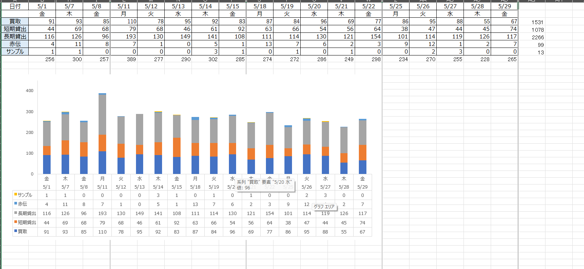

> 【注意】**「0件だから非表示」ではなく「土日祝だから非表示」**で判断してください。
> 稼働日でもたまたま全項目が0の日があります。0かどうかで非表示にすると、その日が抜けてしまいます。

### 4-2. コメントとPowerPoint反映

日報のコメント欄を参考に、当月の特記事項を確認します。

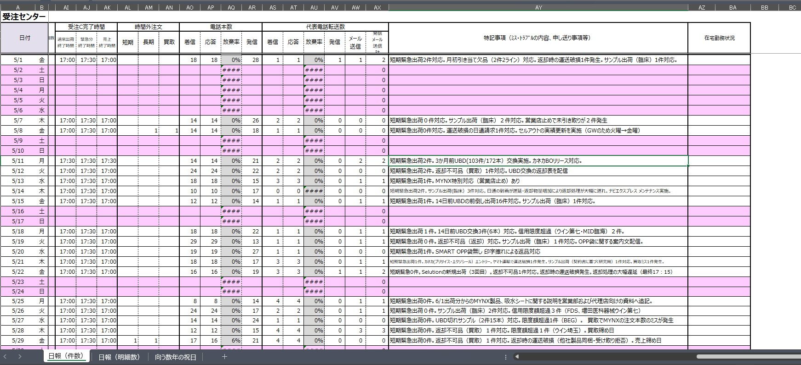

グラフをスライド4へコピーし、コメントを記入します。

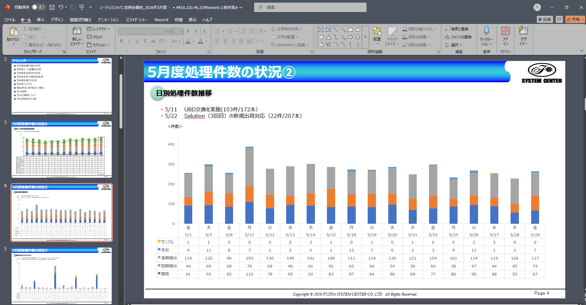

---

## 5. スライド5：八神セルアウト

八神向けの当月セルアウト（一括／買取／長期／短期）を集計します。

### 5-1. 八神sellout集計ファイルを開く

八神のExcelは、ネットワークの次の場所にあります。

```
ネットワーク > fscwork > Tokyo > 10_セルアウト > 八神セルアウト > ★八神sellout集計2026年度.xlsx
```

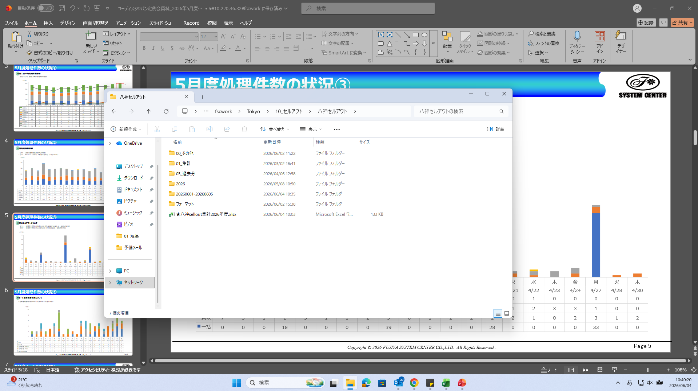

このファイルを開き、**当月タブ（例：`2026.5`）**を選びます。タブは月ごとに分かれています。

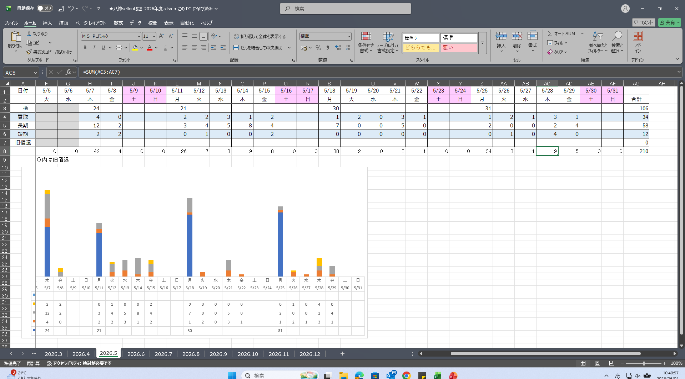

当月タブにデータが入っていることと、グラフが更新されていることを確認します。

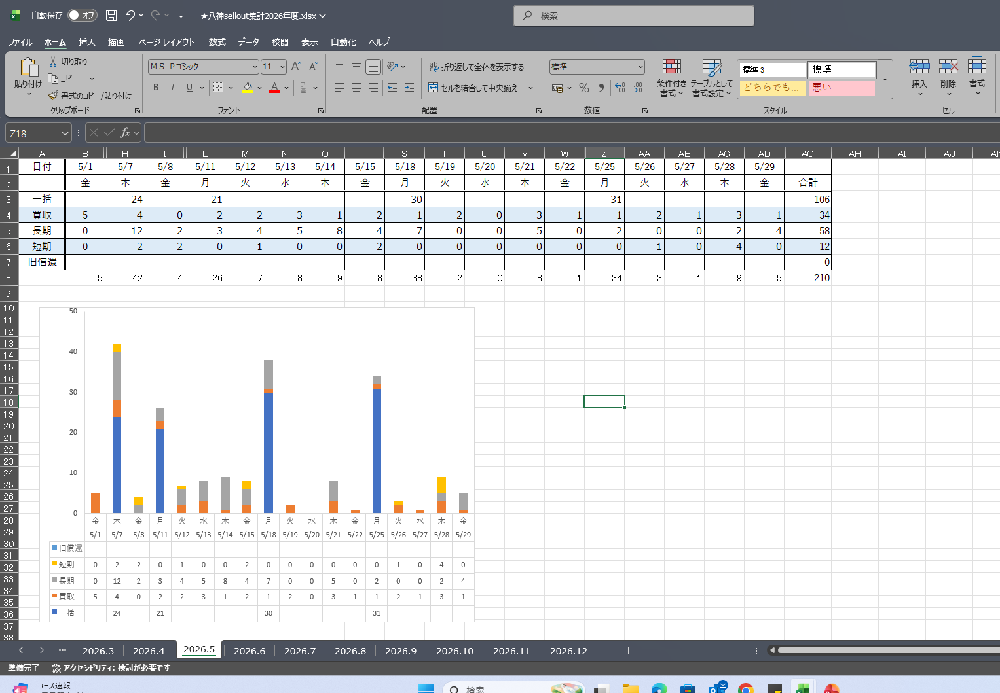

### 5-2. 「一括」行の空欄に手動で 0 を入れる

`一括` の行は、**値のある日（例：24・21・30・31）だけが入っていて、それ以外の日は空欄**になっています。
この**空欄のセルすべてに、手動で `0` を入力**してください。

> 【注意】空欄のままだとグラフや合計に正しく反映されません。`一括` の行を当月の全稼働日ぶん、`0` で埋めて隙間をなくします。

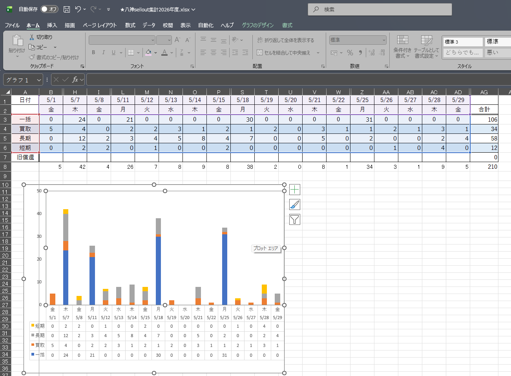

### 5-3. グラフをPowerPointへ

`0` を埋めたら、当月グラフを選択してスライド5へコピーします。

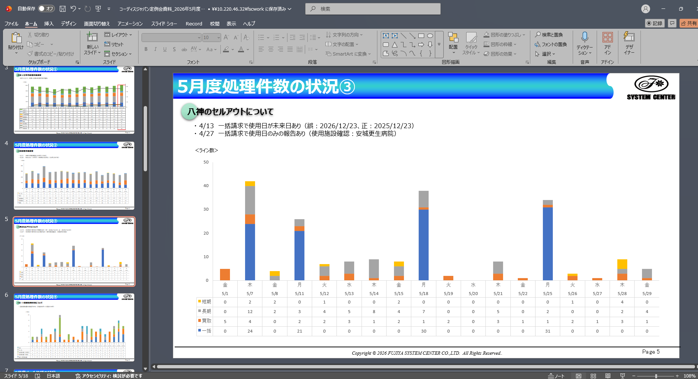

### 5-4. 件数の根拠はOutlookで確認

八神の件数は **Outlookのメールから集計**しています。
件数が多い・少ないと感じたら、該当メールを開いて内訳（理由）を確認できます。

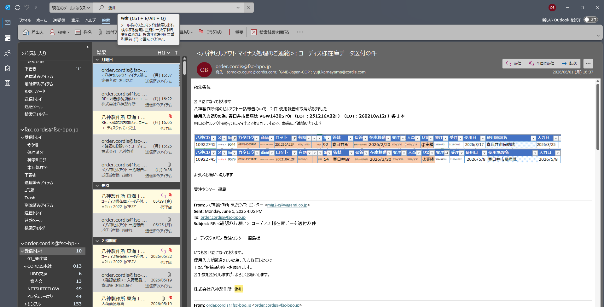

> 【補足】件数が「9件」などになっている場合、**その理由はこのメールで確認できます**（多い月は背景を紐解いておくと、コメントが書きやすくなります）。

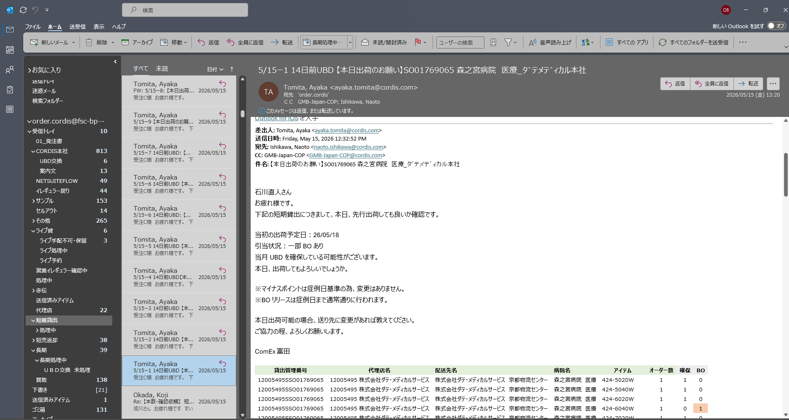

---

## 6. スライド6：サポート業務

サポート業務（補充・使用報告書／返却通知書 ×2／サンプル／赤伝）の当月件数を表示します。

### 6-1. サポートグラフファイルを開く

**`2026年度サポートグラフ.xlsx`** を開き、当月タブ（例：`サポート2026.5`）のグラフを確認します。

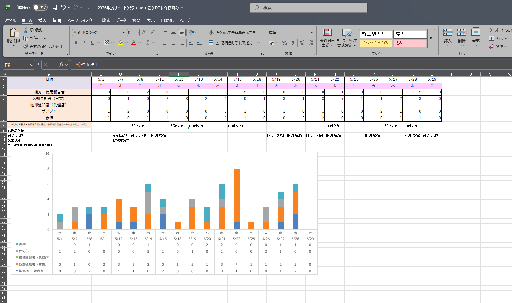

> 【用語】「返却通知書（代理）」は、正式には **「返却・使用通知書」** というタイトルの書類です。
> 該当データはメールブランチの後ろにあります。

### 6-2. グラフをPowerPointへ

グラフをスライド6へコピーし、コメントを記入します。

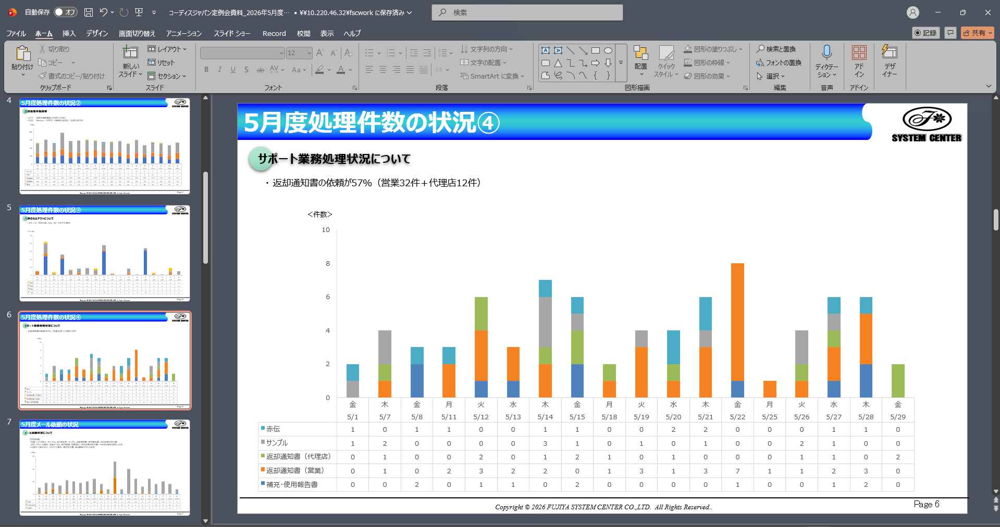

---

## 7. スライド7：メール依頼

メール依頼（その他／代理店／Cordis本社／営業）の当月件数を表示します。

### 7-1. メール依頼ファイルを開く

**`2026年度メール依頼.xlsx`** を開き、当月タブ（例：`メール2026.5`）のグラフを確認します。

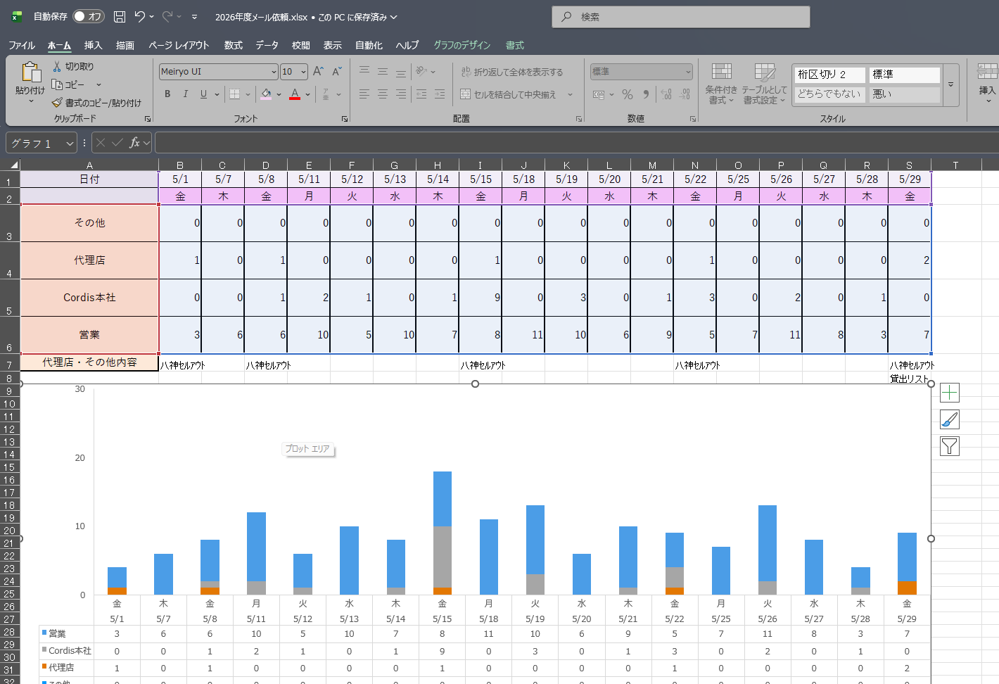

> 【補足】**メール依頼について**
> ここは原則いじるものはありません。集計は関さんがまとめてくれています。
> 件数が多いときは「なぜ多いのか？」を紐解いておく必要があります。

### 7-2. 件数の根拠はOutlookで確認

件数はOutlookで集計しています。必要に応じて該当メールで内訳を確認します。

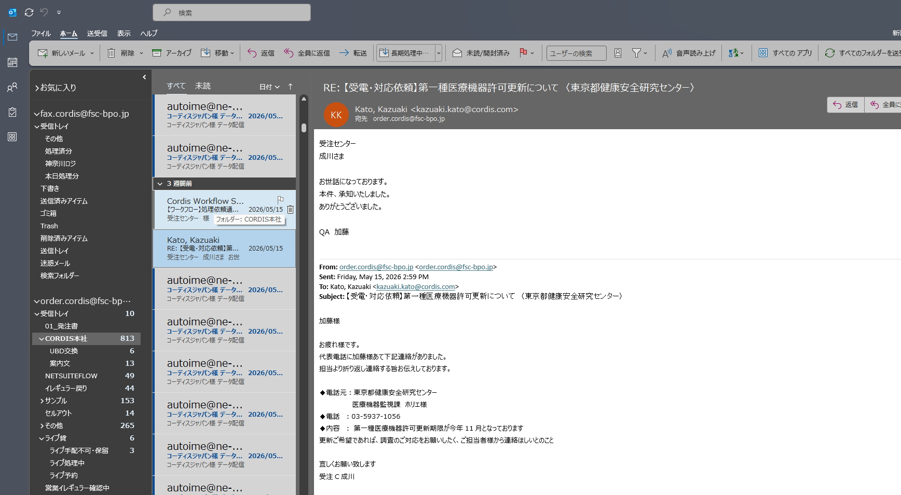

### 7-3. グラフをPowerPointへ

グラフをスライド7へコピーし、コメントを記入します。

---

## 8. スライド8：電話応対（グラフ＋右上の集計表）

当月の**日別 受信／発信件数**の棒グラフと、右上の**集計表（前月比つき）**を更新します。

### 8-1. 受発信の元データを用意する

その月の **`202605受発信.xlsx`**（受信件数／発信件数の日別データ）を開きます。

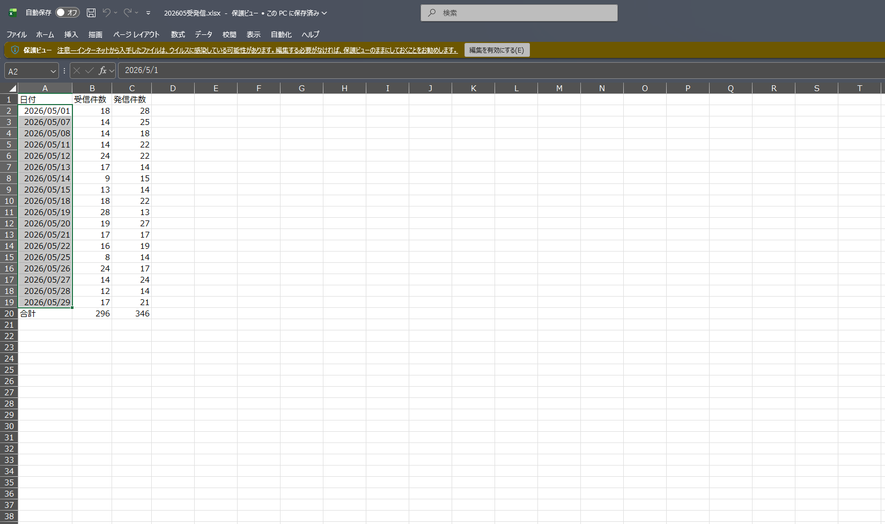

### 8-2. メインExcelの「電話」タブに貼り付ける

メインExcelの **`電話` タブ**を開きます。貼り付け前は前月のデータが入っています。

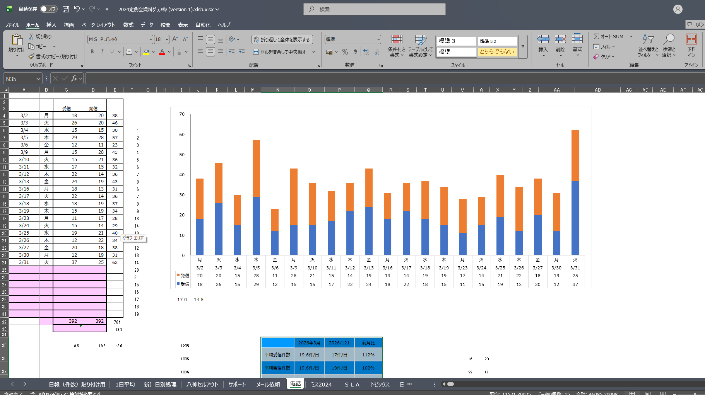

受発信データを `電話` タブに貼り付けると、グラフと数値が当月に切り替わります。

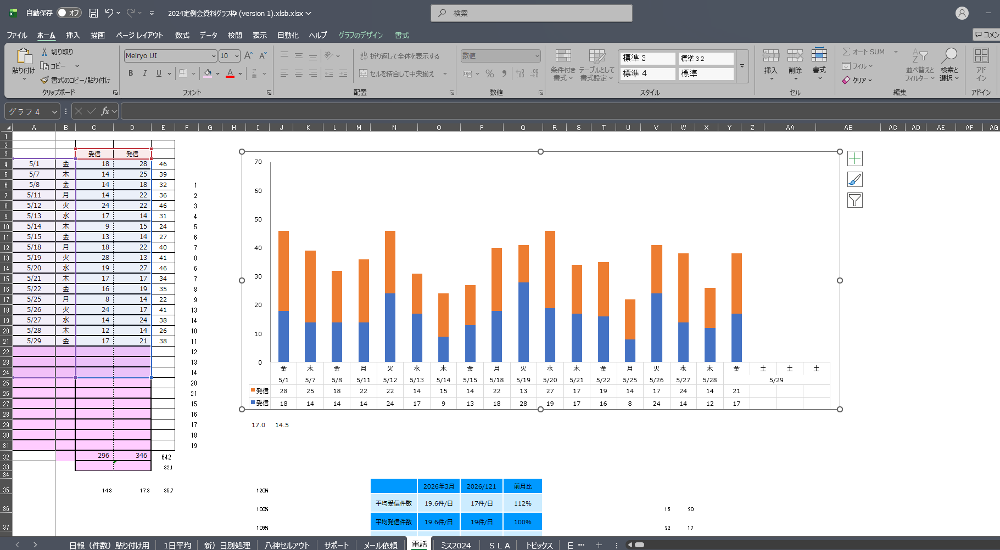

### 8-3. 平均と集計表を更新する

- **平均件数＝合計 ÷ 稼働日数**（例：`=C32/18` のように、合計を稼働日数で割る）で計算します。
- 右上の集計表（`N35:Q38`）には、**当月・前月・前月比（%）**が入ります。

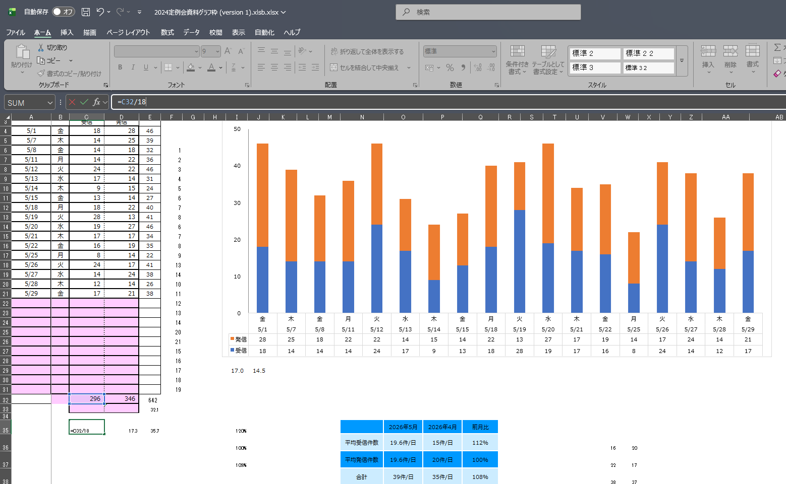

### 8-4. グラフをPowerPointへ（軸の最大値に注意）

グラフをスライド8へコピーします。

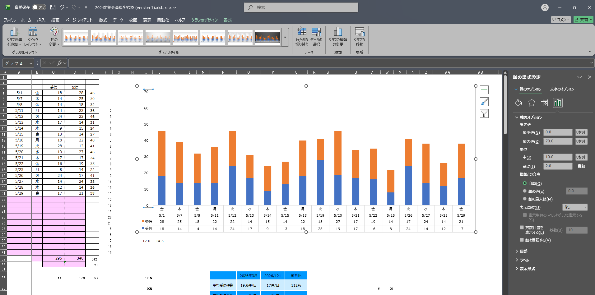

> 【注意】**縦軸の最大値を月に合わせて手調整**します。
> 件数に応じて、**70件以下の月なら最大を50にする**など、見やすい高さに直してください。

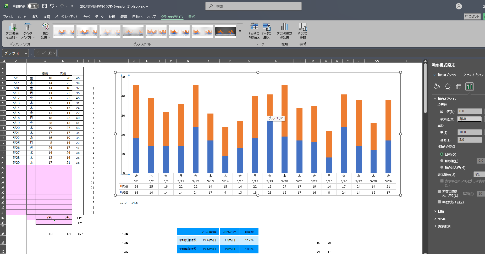

集計表も合わせて貼り付け／更新し、コメントを記入すれば完成です。

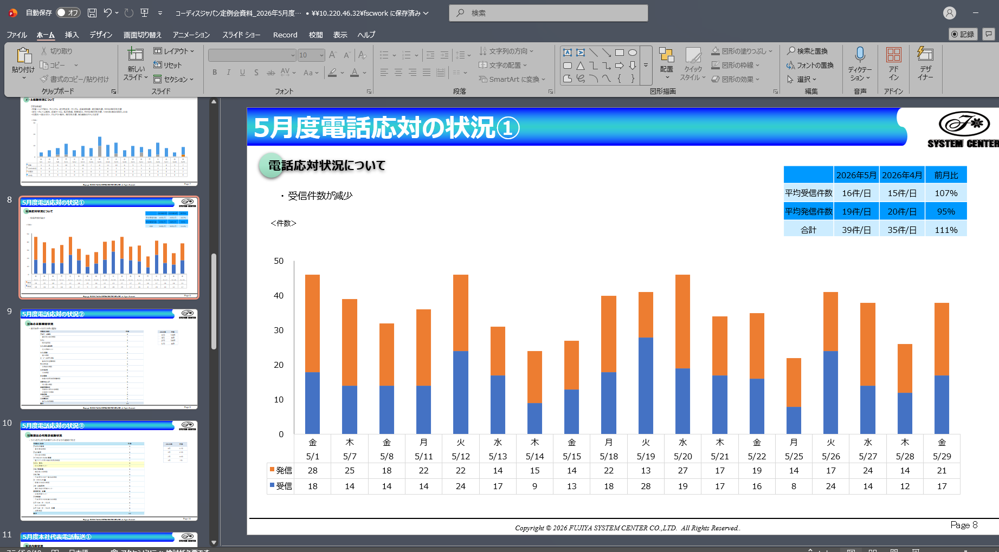

---

## 9. 仕上げ：保存

すべてのスライドを更新し、コメントを記入したら、ネットワークフォルダに保存します。

```
…\16_定例会\2026\
```

- **pptx**（編集用）と **PDF**（配布用）の両方で保存します。
- ファイル名は `コーディスジャパン定例会資料_2026年○月度` の形式に合わせます。

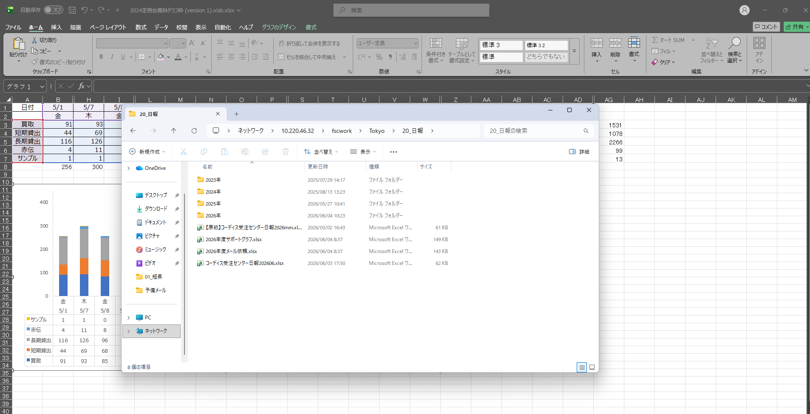

---

## 10. つまずきやすいポイント（チェックリスト）

| # | 注意点 |
|---|---|
| 1 | **月度の書き換えは最初に**。アジェンダ・タイトルの「○月度」を当月へ。 |
| 2 | `1日平均` は `日報（件数）貼り付け用` と**連携している**。当月分を貼り付けて当月分が出来たら、**前月列を数式→値**で固定する（前月の数値が変わらないように）。 |
| 3 | 日別グラフは**土日祝（0件）の列を非表示**（削除しない）。「0だから非表示」ではなく「土日祝だから非表示」。 |
| 3b | 八神セルアウトの **`一括` 行の空欄には手動で `0` を入れる**（空欄のままだとグラフ・合計に反映されない）。 |
| 4 | 電話の平均は**合計 ÷ 稼働日数**。日数を間違えると平均がずれる。 |
| 5 | 電話グラフの**縦軸の最大値は手調整**（70件以下なら50など）。 |
| 6 | 八神・メール・サポートの件数は**Outlook側に根拠**がある。多い月は理由を確認。 |
| 7 | グラフをPowerPointへ貼るときは、**系列の順番・色が崩れていないか**を確認（特にスライド3の複合グラフ）。 |
| 8 | 最後は**pptxとPDFの両方**をネットワークに保存。 |

---

## 付録：データソース対応表

各スライドが、どのファイル・どのシートのどこを参照しているかの一覧です。

| スライド | グラフ／表 | 元ファイル | シート | 参照範囲・備考 |
|---|---|---|---|---|
| 3 | 月別1日平均（棒＋折れ線） | メインExcel | `1日平均` | 行2〜10、報告月を右端に直近13ヶ月。横軸＝日付（yyyy-mm） |
| 4 | 日別処理（積み上げ棒） | メインExcel | `新）日別処理` | 行3〜7。稼働日のみ。横軸＝日付＋曜日 |
| 5 | 八神セルアウト | ★八神sellout集計 | `2026.5` 等 | 行3〜6（一括／買取／長期／短期）。件数はOutlook集計 |
| 6 | サポート業務 | 2026年度サポートグラフ | `サポート2026.5` 等 | 行3〜7（補充・使用報告書／返却通知書×2／サンプル／赤伝） |
| 7 | メール依頼 | 2026年度メール依頼 | `メール2026.5` 等 | 行3〜6（その他／代理店／Cordis本社／営業）。件数はOutlook集計 |
| 8 | 電話応対（棒）＋集計表 | メインExcel | `電話` | グラフ：C/D列（受信/発信）、表：`N35:Q38`。元データ＝`202605受発信.xlsx` |
| 13 | 処理ミス（PPM・折れ線） | メインExcel | `ミス2024` | 横軸＝月、系列＝前年/当年 |

- **祝日**：メインExcelの `向う数年の祝日` シートに祝日リストがあり、稼働日の判定に使います。
- **電話の元データ**：`202605受発信.xlsx` を `電話` タブに貼り付けてから使います。

---

## 付録：自動化ツール `make_teirei.py`

手順3〜8の**グラフ・表・月度見出し・開催日の差し替え**は、Pythonツールで自動化できます。

### 使い方

```bash
python make_teirei.py <出力pptx> <前月版pptx> <Excel...> [--month 2026-05] [--meeting-date 2026-06-12]
```

- Excelは**複数指定・順不同**（メイン＋八神＋サポート＋メールをまとめて渡す）。
- `--month` を省略すると `1日平均` シートの最終月を自動採用。
- `--meeting-date` を省略すると、**報告月の翌月・第2金曜**を自動計算（定例会は原則この日）。

例：

```bash
python make_teirei.py 2026年5月度.pptx 前月版.pptx \
  メインExcel.xlsx 八神sellout.xlsx サポートグラフ.xlsx メール依頼.xlsx --month 2026-05
```

### 必要環境

- Python 3 / `python-pptx`, `openpyxl`

### ツールがやること・やらないこと

- ✅ グラフのデータ差し替え（系列順・色・軸・数値書式・2段カテゴリを保ったまま）
- ✅ 月度見出し・開催日の書き換え、スライド8右上の集計表の更新
- ❌ 分析コメントの記入（人が記入）
- ❌ 縦軸の最大値の自動調整（必要に応じて手調整）
- ❌ ファイルの最終保存（人が保存）

> 詳細な仕様や残タスクは、別紙「定例会資料 自動作成ツール 引き継ぎ資料」を参照してください。
